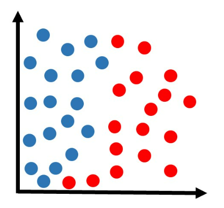

# 📊 KNN (K-Nearest Neighbors) - Python

O que é e como funciona o algoritmo KNN?
O KNN (K-nearest neighbors, ou “K-vizinhos mais próximos”) costuma ser um dos primeiros algoritmos aprendidos por iniciantes no mundo do aprendizado de máquina.

O KNN é muito utilizado em problemas de classificação, e felizmente é um dos algoritmos de machine learning mais fáceis de se compreender.

Em resumo, o KNN tenta classificar cada amostra de um conjunto de dados avaliando sua distância em relação aos vizinhos mais próximos. Se os vizinhos mais próximos forem majoritariamente de uma classe, a amostra em questão será classificada nesta categoria.

Para entender como o KNN funciona detalhadamente, primeiro considere que temos um conjunto de dados dividido em duas classes: azul e vermelho, conforme a figura abaixo.


Agora recebemos uma amostra que ainda não está classificada, e gostaríamos de definir se ela pertence à classe azul ou à classe vermelha. Digamos que essa nova amostra (cor verde na figura abaixo) esteja localizada nessa região:


Intuitivamente, podemos observar que faz mais sentido classificar essa amostra como pertencendo à classe vermelha. Mas o algoritmo não possui “intuição”, ele precisa de um cálculo matemático para poder definir a solução.

No caso do KNN, a lógica é a seguinte:

Observa-se a classe dos vizinhos mais próximos, em uma votação onde a maioria vence. Por exemplo, vamos supor que estamos analisando os 3 vizinhos mais próximos. Obs: mais próximo significa com a menor distância em relação à amostra:


Na figura acima, podemos ver que os 3 vizinhos mais próximos pertencem à classe vermelha. Então como houve 3 votos a zero para a classe vermelha, essa amostra fica sendo classificada nessa classe:


Obs: talvez agora esteja mais claro o significado do nome “KNN”, que refere-se a “k-vizinhos mais próximos”, onde k é um número que podemos determinar. Nesse exemplo, estamos usando k=3.
Agora recebemos outra amostra que queremos classificar:


Utilizando o mesmo método KNN com k=3:


Encontramos os 3 vizinhos mais próximos dessa amostra. Dessa vez, há duas amostras da classe vermelha e uma da classe azul. Como a votação ficou 2×1 para a classe vermelha, essa amostra ficaria sendo classificada nessa classe:


Essa metodologia poderia ser aplicada para qualquer nova amostra e estaríamos aptos a definir sua devida classificação. Porém até agora utilizamos apenas o exemplo de k=3. Na prática, podemos escolher outro valor de k.

Vamos supor que a mesma amostra anterior estivesse sendo analisada com o algoritmo de KNN com k=5:


Dessa vez, dos 5 vizinhos mais próximos, 3 são azuis e 2 são vermelhos. Portanto a classe vencedora foi a azul. Essa amostra seria classificada nessa classe:


Nota-se que, dependendo do valor de k, poderemos ter resultados diferentes para cada situação.

Quando o k é pequeno, a classificação fica mais sensível a regiões bem próximas (podendo ocorrer o problema de overfitting). Com k grande, a classificação fica menos sujeita a ruídos pode ser considerada mais robusta, porém se k for grande demais, pode ser que haja o problema de underfitting.

Obs: nos exemplos desse artigo, tentamos mostrar visualmente quais eram os vizinhos mais próximos em cada situação. Porém não podemos esquecer que a forma como o algoritmo faz essa seleção é calculando a distância de cada um dos pontos já classificados em relação à nova amostra que queremos classificar. Ou seja, como nos exemplos havia cerca de 30 amostras já classificadas, o algoritmo KNN teria que fazer o cálculo da distância de cada um desses pontos em relação à nova amostra, e ordenar depois do menor ao maior, selecionando assim as amostras mais próximas.


Este repositório apresenta uma implementação simples do algoritmo **KNN (K-Nearest Neighbors)** utilizando Python.
---

## 🚀 Objetivo

Demonstrar de forma didática:

* Como funciona o algoritmo KNN
* Como treinar um modelo com `scikit-learn`
* Como visualizar os dados com `matplotlib`
* Como classificar um novo ponto

---

## 📦 Tecnologias utilizadas

* Python 3
* scikit-learn
* matplotlib

---

## 🧠 Conceito do KNN

O KNN é um algoritmo de aprendizado supervisionado que classifica novos dados com base nos **K vizinhos mais próximos**.

📌 Ideia central:

> “Diga-me quem são seus vizinhos e eu direi quem você é.”

---

## 💻 Código completo

```python
import matplotlib.pyplot as plt

# Dados (features)
num_1 = [21, 22, 27, 21, 20, 28, 31, 23, 27, 29]
num_2 = [38, 36, 41, 34, 33, 42, 41, 39, 38, 38]

# Classes (rótulos)
classes = [0, 0, 1, 0, 0, 1, 1, 0, 1, 1]

# Plot inicial
plt.scatter(num_1, num_2, c=classes)
plt.show()

from sklearn.neighbors import KNeighborsClassifier

# Junta os dados (x,y)
data = list(zip(num_1, num_2))
print(data)

# Modelo KNN (k=1)
knn = KNeighborsClassifier(n_neighbors=1)

# Treinamento
knn.fit(data, classes)

# Novo ponto
new_x = 25
new_y = 38
new_point = [(new_x, new_y)]

# Predição
prediction = knn.predict(new_point)

# Plot com novo ponto
plt.scatter(num_1 + [new_x], num_2 + [new_y], c=classes + [prediction[0]])
plt.text(x=new_x-1.7, y=new_y-0.7, s=f"new point, class: {prediction[0]}")
plt.show()
```

---

## 🔍 Explicação linha por linha

### 📌 Importação da biblioteca de gráficos

```python
import matplotlib.pyplot as plt
```

Importa a biblioteca responsável por criar gráficos.

---

### 📌 Definição dos dados (features)

```python
num_1 = [...]
num_2 = [...]
```

Representam duas variáveis de entrada (eixos X e Y).

---

### 📌 Classes (rótulos)

```python
classes = [...]
```

Define a categoria de cada ponto:

* `0` → Classe A
* `1` → Classe B

---

### 📌 Visualização inicial

```python
plt.scatter(num_1, num_2, c=classes)
```

Cria um gráfico de dispersão:

* Eixo X → `num_1`
* Eixo Y → `num_2`
* Cor → classe

```python
plt.show()
```

Exibe o gráfico.

---

### 📌 Importação do KNN

```python
from sklearn.neighbors import KNeighborsClassifier
```

Importa o algoritmo KNN da biblioteca `scikit-learn`.

---

### 📌 Organização dos dados

```python
data = list(zip(num_1, num_2))
```

Combina os dados em pares `(x, y)`:

```python
[(21,38), (22,36), ...]
```

```python
print(data)
```

Exibe os dados no console.

---

### 📌 Criação do modelo

```python
knn = KNeighborsClassifier(n_neighbors=1)
```

Define o modelo com:

* `k = 1` → considera apenas o vizinho mais próximo

---

### 📌 Treinamento

```python
knn.fit(data, classes)
```

O modelo aprende a relação entre os dados e suas classes.

---

### 📌 Novo ponto para classificação

```python
new_x = 25
new_y = 38
```

Define um ponto desconhecido.

```python
new_point = [(new_x, new_y)]
```

Formata no padrão exigido pelo modelo.

---

### 📌 Predição

```python
prediction = knn.predict(new_point)
```

O modelo:

1. Calcula distâncias
2. Encontra o vizinho mais próximo
3. Define a classe

---

### 📌 Visualização final

```python
plt.scatter(num_1 + [new_x], num_2 + [new_y], c=classes + [prediction[0]])
```

Adiciona o novo ponto ao gráfico.

```python
plt.text(x=new_x-1.7, y=new_y-0.7, s=f"new point, class: {prediction[0]}")
```

Exibe a classe do novo ponto no gráfico.

```python
plt.show()
```

Mostra o resultado final.

---

## 📊 Resultado esperado

* Pontos coloridos por classe
* Novo ponto classificado automaticamente
* Visualização clara do funcionamento do KNN

---

## 📌 Autor

George Barbosa


---
